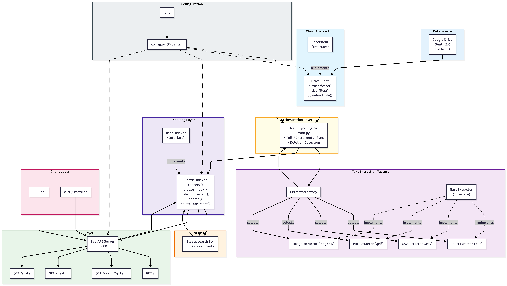

# Document Search

A lightweight document search service that connects to Google Drive, extracts text from files, indexes content in Elasticsearch, and provides search capabilities through REST API and CLI.

## Features

- **Google Drive Integration** - OAuth 2.0 authentication and file synchronization
- **Multi-Format Support** - Extract text from `.txt`, `.csv`, `.pdf` files
- **Full-Text Search** - Powered by Elasticsearch with relevance ranking
- **REST API** - FastAPI endpoints for search operations
- **CLI Tool** - Command-line interface for quick searches
- **Incremental Sync** - Only re-index modified files
- **Deletion Sync** - Automatically remove deleted files from index

## Architecture

### High-Level System Design



### Component Details

#### 1. Data Source Layer
**Google Drive Integration**
- OAuth 2.0 authentication with token caching
- Folder-based file listing (recursive)
- Support for regular files and Google Workspace exports
- Metadata: file_id, name, path, mime_type, modified_time, size, url

#### 2. Cloud Abstraction Layer
**Design Pattern**: Strategy Pattern
- `BaseClient`: Abstract interface for cloud storage
- `DriveClient`: Google Drive implementation
- **Extensibility**: Easy to add Dropbox, S3, Azure Blob

```python
CloudFile = CloudFile(
    file_id, name, path, url,
    mime_type, size, modified_time
)
```

#### 3. Text Extraction Layer
**Design Pattern**: Factory Pattern + Strategy Pattern
- `BaseExtractor`: Abstract extractor interface
- `ExtractorFactory`: Selects appropriate extractor by MIME type
- **Supported Formats**:
  - `.txt` → TextExtractor (UTF-8/Latin-1)
  - `.csv` → CSVExtractor (formatted with headers)
  - `.pdf` → PDFExtractor (pdfminer.six)
  - `.png` → ImageExtractor (pytesseract OCR)

#### 4. Indexing Layer
**Design Pattern**: Repository Pattern
- `BaseIndexer`: Abstract indexer interface
- `ElasticIndexer`: Elasticsearch implementation
- **Index Schema**:
```json
{
  "file_id": "unique-identifier",
  "file_name": "document.txt",
  "file_path": "folder/document.txt",
  "url": "https://drive.google.com/file/d/...",
  "mime_type": "text/plain",
  "extracted_text": "full text content...",
  "updated_time": "2026-01-20T15:30:00",
  "size": 1024,
  "indexed_time": "2026-01-20T16:02:00"
}
```

#### 5. Storage Layer
**Elasticsearch 8.11**
- Single-node cluster (development)
- Full-text search with BM25 scoring
- Multi-field matching (file_name, file_path, extracted_text)
- Result highlighting with `<em>` tags
- Document CRUD operations

#### 6. API Layer
**FastAPI REST Service**
- **Endpoints**:
  - `GET /` - Service information
  - `GET /search?q=term&limit=10` - Search documents
  - `GET /health` - Health check
  - `GET /stats` - Index statistics
- **Features**:
  - CORS middleware
  - Pydantic request/response models
  - Async lifespan for ES connection
  - Error handling with HTTP status codes

#### 7. Client Layer
**CLI Tool (Click Framework)**
- Interactive colored output
- Arguments: query string
- Options: --limit/-l for result count
- Displays: filename, score, path, URL, highlights

#### 8. Orchestration Layer
**Main Pipeline Script**
- **Full Sync**: Index all files from Drive
- **Incremental Sync**: Only new/modified files
- **Deletion Sync**: Remove files deleted from Drive
- **Features**:
  - Progress logging for each file
  - Error handling with retry capability
  - Summary statistics report
  - Command-line flags: --incremental, --clean

#### 9. Configuration Management
**Pydantic Settings**
- Type-safe configuration from `.env`
- Environment variable validation
- Default values for optional settings
- Used across all components

### Data Flow Diagrams

#### Indexing Flow
```
┌─────────────┐
│Google Drive │
└──────┬──────┘
       │ 1. OAuth Authenticate
       │ 2. List Files
       ▼
┌─────────────┐
│DriveClient  │
└──────┬──────┘
       │ 3. Download File Content
       ▼
┌─────────────┐
│  Extractor  │
│   Factory   │
└──────┬──────┘
       │ 4. Extract Text
       ▼
┌─────────────┐
│Elasticsearch│
│  Indexer    │
└──────┬──────┘
       │ 5. Index Document
       ▼
┌─────────────┐
│Elasticsearch│
│   Cluster   │
└─────────────┘
```

#### Search Flow
```
┌─────────────┐
│  CLI Tool   │
│     or      │
│ HTTP Client │
└──────┬──────┘
       │ 1. GET /search?q=term
       ▼
┌─────────────┐
│  FastAPI    │
│   Server    │
└──────┬──────┘
       │ 2. Search Query
       ▼
┌─────────────┐
│Elasticsearch│
│  Indexer    │
└──────┬──────┘
       │ 3. Execute Query
       ▼
┌─────────────┐
│Elasticsearch│
│   Cluster   │
└──────┬──────┘
       │ 4. Return Results
       ▼
┌─────────────┐
│JSON Response│
│with Metadata│
│& Highlights │
└─────────────┘
```

#### Deletion Sync Flow
```
┌─────────────┐
│Google Drive │ Current Files: [A, B, C]
└──────┬──────┘
       │
       ▼
┌─────────────┐
│Elasticsearch│ Indexed Files: [A, B, C, D]
└──────┬──────┘
       │
       ▼ Compare file_id sets
┌─────────────┐
│   Main.py   │ Detect: D is deleted
└──────┬──────┘
       │
       ▼ Delete document D
┌─────────────┐
│Elasticsearch│ Indexed Files: [A, B, C]
└─────────────┘
```

### Design Patterns Used

1. **Abstract Factory Pattern**: ExtractorFactory selects appropriate text extractor
2. **Strategy Pattern**: Interchangeable extractors and cloud clients
3. **Repository Pattern**: ElasticIndexer abstracts storage operations
4. **Dependency Injection**: Settings passed through constructors
5. **Factory Method**: DriveClient creates CloudFile objects

### Technology Stack

| Layer | Technology | Version |
|-------|-----------|---------|
| Language | Python | 3.11.6 |
| API Framework | FastAPI | 0.115.0 |
| Web Server | Uvicorn | 0.32.0 |
| Search Engine | Elasticsearch | 8.11.0 |
| Cloud API | Google Drive API | v3 |
| PDF Extraction | pdfminer.six | 20221105 |
| OCR | pytesseract | 0.3.13 |
| CLI Framework | Click | 8.1.7 |
| Configuration | Pydantic | 2.10.0 |
| Container | Docker Compose | - |

### Scalability Considerations

#### Current Design (Development)
- Single Elasticsearch node
- Synchronous file processing
- No authentication on API
- Local OAuth token storage

#### Production Enhancements
1. **Elasticsearch Cluster**: Multi-node setup with replication
2. **Async Processing**: Celery/RQ for background indexing
3. **Batch Operations**: Bulk indexing for large folders
4. **API Security**: OAuth/JWT authentication
5. **Rate Limiting**: Prevent API abuse
6. **Monitoring**: Prometheus + Grafana metrics
7. **Cloud Token Storage**: HashiCorp Vault for secrets
8. **Load Balancing**: Multiple API instances
9. **Caching**: Redis for frequent queries
10. **Webhook Support**: Real-time Drive change notifications

### Security Features

1. **OAuth 2.0**: Secure Google Drive authentication
2. **Token Caching**: Local token.json for session persistence
3. **Read-only Scope**: Drive API limited to metadata.readonly
4. **Environment Variables**: Credentials in .env (gitignored)
5. **CORS Configuration**: Configurable allowed origins
6. **Input Validation**: Pydantic models for API requests

### Error Handling

1. **Connection Failures**: Retry logic with exponential backoff
2. **Extraction Errors**: Skip file, log error, continue pipeline
3. **Index Failures**: Log document ID, report in summary
4. **API Errors**: HTTP status codes with error messages
5. **OAuth Failures**: Clear instructions to re-authenticate

### Testing Strategy

- **Integration Tests**: test_drive.py, test_extractors.py, test_indexer.py, test_api.py
- **Manual Testing**: CLI commands with real data
- **Health Checks**: API /health endpoint
- **Index Verification**: /stats endpoint for document counts

### Performance Metrics

Based on current implementation:
- **Indexing Speed**: ~2.5 files/second (4 files in 9 seconds)
- **Download Time**: ~1.3 seconds per file (Google API latency)
- **Extraction Time**: <100ms per file
- **Index Time**: ~750ms per document (with refresh)
- **Search Latency**: <50ms for typical queries

### Future Enhancements

1. **Multiple Cloud Services**: Dropbox, S3, Azure Blob support
2. **Real-time Sync**: Webhook-based change detection
3. **Advanced Search**: Fuzzy matching, faceted search, filters
4. **Document Preview**: Thumbnail generation and preview
5. **User Management**: Multi-user support with permissions
6. **Search Analytics**: Query logging and popular searches
7. **File Versioning**: Track document version history
8. **Advanced OCR**: Handwriting recognition, multi-language
9. **Relevance Tuning**: Custom analyzers, boosting fields
10. **Export Features**: Search results as CSV/JSON

## Prerequisites

- Python 3.11+
- Docker (for Elasticsearch)
- Google Cloud Project with Drive API enabled
- OAuth 2.0 credentials

## Installation

### 1. Clone the repository
```bash
cd /path/to/document-search
```

### 2. Create virtual environment
```bash
python3.11 -m venv venv
source venv/bin/activate  # On macOS/Linux
# On Windows: venv\Scripts\activate
```

### 3. Install dependencies
```bash
pip install -r requirements.txt
```

### 4. Start Elasticsearch
```bash
docker compose up -d
```

Verify Elasticsearch is running:
```bash
curl http://localhost:9200
```

### 5. Configure environment variables
```bash
cp .env.example .env
```

Edit `.env` and add your credentials:
```bash
GOOGLE_CLIENT_ID=your-client-id.apps.googleusercontent.com
GOOGLE_CLIENT_SECRET=your-client-secret
GOOGLE_DRIVE_FOLDER_ID=your-folder-id
ELASTICSEARCH_HOST=http://localhost:9200
ELASTICSEARCH_INDEX=documents
```

## Usage

### Index Documents from Google Drive

**Full sync (index all files):**
```bash
python -m search_service.main
```

**Incremental sync (only new/modified files):**
```bash
python -m search_service.main --incremental
```

**Clean and re-index:**
```bash
python -m search_service.main --clean
```

### Start the API Server

```bash
python -m search_service.api.app
```

API will be available at:
- Base URL: http://localhost:8000
- Interactive docs: http://localhost:8000/docs
- Health check: http://localhost:8000/health

### Use the CLI

```bash
# Basic search
python search_service/cli/search_cli.py "engineering"

# With limit
python search_service/cli/search_cli.py "search" --limit 5

# Short form
python search_service/cli/search_cli.py "laptop" -l 3
```

### API Endpoints

**Search documents:**
```bash
curl "http://localhost:8000/search?q=engineering&limit=10"
```

**Health check:**
```bash
curl http://localhost:8000/health
```

**Statistics:**
```bash
curl http://localhost:8000/stats
```

## API Response Example

```json
{
  "query": "engineering",
  "total_results": 2,
  "results": [
    {
      "file_name": "employee_data.csv",
      "file_path": "employee_data.csv",
      "url": "https://drive.google.com/file/d/...",
      "mime_type": "text/csv",
      "score": 1.24,
      "updated_time": "2026-01-20T15:30:00",
      "highlights": ["...Alice Johnson | <em>Engineering</em> | 95000..."]
    }
  ]
}
```

## Project Structure

```
document-search/
├── docker-compose.yml          # Elasticsearch container
├── requirements.txt            # Python dependencies
├── .env                        # Configuration (not in git)
├── .env.example               # Configuration template
└── search_service/
    ├── cloud/
    │   ├── base_client.py     # Abstract cloud storage interface
    │   └── drive_client.py    # Google Drive implementation
    ├── extractor/
    │   ├── base_extractor.py  # Abstract text extractor
    │   ├── text_extractor.py  # Plain text extraction
    │   ├── csv_extractor.py   # CSV extraction
    │   ├── pdf_extractor.py   # PDF extraction
    │   └── extractor_factory.py
    ├── indexer/
    │   ├── base_indexer.py    # Abstract indexer interface
    │   └── elastic_indexer.py # Elasticsearch implementation
    ├── api/
    │   └── app.py             # FastAPI application
    ├── cli/
    │   └── search_cli.py      # Command-line tool
    ├── config.py              # Configuration management
    └── main.py                # Main orchestration script
```

## Development

### Run Tests

```bash
# Test Google Drive connection
python test_drive.py

# Test text extractors
python test_extractors.py

# Test Elasticsearch indexer
python test_indexer.py

# Test API
python test_api.py
```

### Stop Services

```bash
# Stop Elasticsearch
docker compose down

# Stop API server
# Press Ctrl+C in the terminal running the server
```

## Troubleshooting

### Elasticsearch connection refused
- Make sure Docker is running
- Start Elasticsearch: `docker compose up -d`
- Wait 15-20 seconds for startup
- Check status: `docker compose ps`

### Google OAuth errors
- Ensure OAuth consent screen is set to "External"
- Add your email as a test user in Google Cloud Console
- Delete `token.json` and re-authenticate if needed

### No files found
- Verify folder ID in `.env` matches your Google Drive folder
- Ensure files are uploaded to the correct folder
- Check folder permissions

## License

MIT License

## Authors

Built as part of AI Engineer machine coding assessment.
